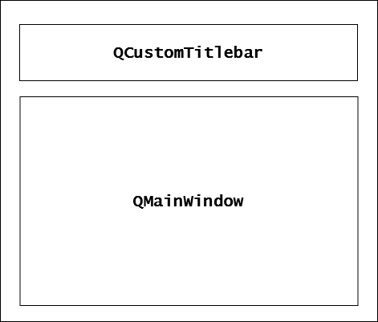
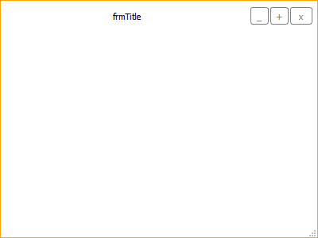

# QCustomWindow

QCustomWindow (former QCustomTitlebar) is a project in which its main class (QCustomWindow) inherits its properties from [QWidget](https://doc.qt.io/qt-6/qwidget.html), wrapping a [QMainWindow](https://doc.qt.io/qt-6/qmainwindow.html) class instance.

It basically consists of a customized widget providing a customized non-client area which wraps a [QMainWindow](https://doc.qt.io/qt-6/qmainwindow.html), as represented in the following image:

  <figure>
	
	<figcaption>Fig. 1: QCustomWindow simplified layout.</figcaption>
  </figure>  

## Screenshot

  <figure>
	
	<figcaption>Fig. 2: Regular-sized custom window in light theme.</figcaption>
  </figure>  

Please, refer to [screenshots](docs/imgs/screenshots) for more images.

## Support and Documentation

Docs elaboration is still in progress :( ...  
Should you have any doubts, do not hesitate in contacting me through [my email](mailto:mauro.mascarenhas@nintersoft.com).

## Features:

- Dynamic pointer styles;
- Customized stylesheet (light theme);
- Uses new QWindow's [move](https://doc.qt.io/qt-5/qwindow.html#startSystemMove)/[resize](https://doc.qt.io/qt-5/qwindow.html#startSystemResize) API by default (use QCustomWindow::setForceCustomMove(bool) and QCustomWindow::setForceCustomResize(bool) so as to change behaviour);
- Window title update ([QWidget::setWindowTitle(QString)](https://doc.qt.io/qt-6/qwidget.html#windowTitle-prop)) working properly;
- Better performance (when compared to previous versions);
- Direct access to [QMainWindow](https://doc.qt.io/qt-6/qmainwindow.html) instance (without restricted access to its methods and properties);
- Dynamically Linked Library (DLL) binaries available for Windows.

## Observations:

- Should you use a [QStatusBar](https://doc.qt.io/qt-6/qstatusbar.html), it is strongly recommended that you provide at least a basic stylesheet which removes its borders as well;
- Limitations from [release v2.x](https://github.com/Nintersoft/CustomTitlebar/releases/tag/v2.0.0) are no longer an actual issue.

## Distribution (available versions):

- [x] DLL + LIB + headers;
- [x] Stactic linking/source files;
- [ ] Qt Creator/Designer plugin.

## CustomTitlebar open source code

- You can download and make modifications in the source code, accordingly to Mozilla Public Licence v2.0 terms;
- The licence is available in the root of the project directory and must be always shipped with it.
